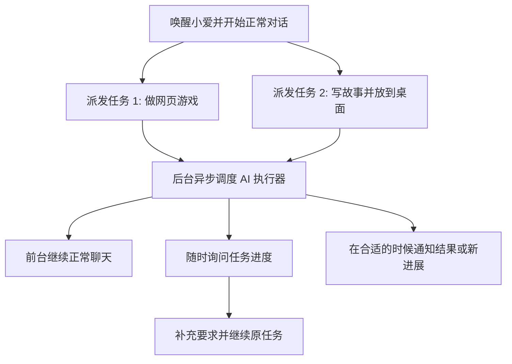

# XiaoAiAgent

[](https://github.com/luoliwoshang/open-xiaoai-agent/actions/workflows/ci.yml)
[](https://codecov.io/gh/luoliwoshang/open-xiaoai-agent)

`XiaoAiAgent` 是面向 [`open-xiaoai`](https://github.com/idootop/open-xiaoai) 生态的独立服务端，仓库名为 `open-xiaoai-agent`。

它想做的事情很简单：把“小爱同学”从一个语音入口，增强成一个真正能对话、能接任务、能追进度、能回来继续做事的 AI 助理。

现在你可以像平常一样先唤醒小爱，然后直接和它正常对话；也可以在对话里顺手把复杂任务派给它，比如做网页、写故事、整理文档、生成内容。前台对话不需要被这些耗时任务卡住，后台会异步调度 AI 执行器持续处理，并在合适的时候把进展或结果再告诉你。

当前后端已经接上了 Claude Code CLI，后续会继续接入 Codex、OpenClaw、OpenCode 等 AI 执行器，把“小爱负责沟通、后台 AI 负责干活”这条链路做完整。

边界上可以简单理解为：

- `open-xiaoai` 负责设备 / client 桥接
- `open-xiaoai-agent` 负责服务端编排

## 它增强了什么

- 唤醒小爱后，不只是一次性问答，而是可以继续自然对话
- 日常聊天过程中，可以直接给小爱派发复杂任务，不需要切到电脑前手动操作
- 复杂任务走异步执行，不阻塞当前对话；你可以一边聊天，一边让后台继续干活
- 任务不是“一次说完就丢”，而是可以查进度、补充要求、继续追着做
- 系统会保留任务上下文，后续像“刚刚那个网页再炫酷一点”这类补充，能继续命中原来的任务
- 后台执行器是可插拔的，当前是 Claude Code，后续会扩展到更多 AI 工具

## 一个更像助理的使用方式

你现在可以这样用它：

```text
你：小爱同学，今天天气怎么样？
小爱：先正常回答你天气。

你：帮我做一个小白兔追击大灰狼的网页游戏。
小爱：收到，这个任务我先去处理。

你：再帮我做一个小白兔和猎人的故事，放在我的桌面吧。
小爱：好，这个也一起安排。

你：那顺便再说一下今天适不适合出门？
小爱：继续正常聊天，不会因为后台任务而卡住。

你：刚刚那个网页游戏做得怎么样了？
小爱：可以回答任务进度，而不是丢失上下文。

你：小白兔追击大灰狼可以更炫酷一点呀。
小爱：会继续命中刚才那个任务，在原任务上下文里接着做。
```

这个产品想强调的点不是“能调多少工具”，而是下面这件事：

- 对用户来说，入口仍然是熟悉的小爱
- 对体验来说，复杂任务不再阻塞当前对话
- 对任务来说，系统会主动调度、持续跟踪，并在合适的时候通知你
- 对上下文来说，不只是记住聊天，还要记住“具体是哪一个任务正在被继续推进”

## 异步任务流程



`docs` 目录中提供了两类补充说明：一份讲异步任务和主流程的协作结构，一份单独讲 Claude Code 的接入实现。

## 当前支持

- 接收 `open-xiaoai` client 通过 WebSocket 转发的最终 ASR 文本
- 使用 `intent` 模型判断普通聊天、工具调用或异步任务
- 使用 `reply` 模型流式生成回复，并通过设备侧 TTS 播放
- 管理轻量异步任务，并在合适的时候汇报任务结果
- 提供独立的 React + Vite Dashboard 调试控制台
- Dashboard 的定位是调试与排障，不是面向普通用户的日常工作台
- Dashboard 支持手动把一段识别文本送入服务端 debug 主流程；它与真实小爱入口共享主语音上下文，但不依赖真实设备在线
- Dashboard 会展示当前小爱设备连接状况，方便确认 WebSocket client 是否在线
- 提供后端日志中心，可在调试控制台里分页查看 Go server 日志
- 使用 MySQL 保存任务、会话和插件私有状态
- 会话上下文默认使用滑动窗口，并支持在 Dashboard 调试台中调整窗口秒数
- 提供第一期独立 IM Gateway：支持微信扫码登录、确认添加账号、多账号管理、文本触达配置，以及默认渠道的文本 / 图片调试发送
- 支持把小爱的正常回复异步镜像到选中的微信私聊目标，不阻塞设备侧播报

当前内置工具：

- `ask_weather`
- `ask_stock`
- `list_tools`
- `complex_task`
- `query_task_progress`
- `cancel_task`
- `continue_task`

其中：

- `complex_task` 用于受理复杂、耗时较长、需要后台持续执行的任务
- `query_task_progress` 用于追问任务进展
- `continue_task` 用于在原任务上下文里继续补充要求
- `cancel_task` 当前已提供基础能力，后续还会继续优化取消体验

`complex_task` / `continue_task` 当前通过 Claude Code CLI 执行；如果要使用这类任务，需要本机可用 `claude` 命令。

## 工作方式

1. 用户唤醒原生小爱并说话。
2. `open-xiaoai` client 把 `SpeechRecognizer.RecognizeResult` 转发到本服务。
3. 服务端执行 `intent` / `reply` / tools / tasks。
4. 回复通过现有 client 播放链路回到设备。

## 依赖

- Go `1.24+`
- Node.js + npm
- MySQL `8.x+`
- 一个可用的 OpenAI 兼容接口
- 高德天气 API Key（仅 `ask_weather` 需要）
- Claude Code CLI（仅 `complex_task` / `continue_task` 需要）

## 快速开始

1. 复制配置文件：

```sh
cp config.example.yaml config.yaml
```

2. 按需修改 `config.yaml`：

```yaml
database:
  dsn: root:root@tcp(127.0.0.1:3306)/open_xiaoai_agent

openai:
  base_url: https://api.openai.com/v1

amap:
  api_key: ""

intent:
  model: qwen-turbo
  base_url: https://dashscope.aliyuncs.com/compatible-mode/v1
  api_key: sk-intent-placeholder

reply:
  model: qwen-turbo
  base_url: https://dashscope.aliyuncs.com/compatible-mode/v1
  api_key: sk-reply-placeholder

im:
  media_cache_dir: .cache/im-media
```

`SOUL.md` 会在启动时一并读取，用于定义主回复的人设。`config.yaml` 已被忽略，不要提交真实密钥。

`database.dsn` 是当前唯一的数据库配置入口，启动时会直接从 `config.yaml` 读取。
`im.media_cache_dir` 用于缓存上传到 IM 网关的图片文件；默认值是仓库根目录下的 `.cache/im-media`，当前不会自动清理。

3. 启动本地 MySQL：

```sh
npm run db:up
```

仓库根目录自带了 `compose.yaml`，会启动一个本地 MySQL 8 容器，默认连接信息就是上面的 `root:root@tcp(127.0.0.1:3306)/open_xiaoai_agent`。

4. 直接启动：

```sh
npm install
npm run dev
```

服务启动后会自动：

- 创建目标数据库（如果还不存在）
- 创建运行期所需表结构
- 写入默认会话窗口设置 `session.window_seconds = 300`

默认端口：

- WebSocket server: `:4399`
- Dashboard API: `:8090`
- Web debug dashboard: `http://127.0.0.1:5173/#/`
- Settings page: `http://127.0.0.1:5173/#/settings`
- Logs page: `http://127.0.0.1:5173/#/logs`

如果只启动后端：

```sh
go run .
```

如果只启动当前前端：

```sh
npm run dev:fe
```

如果需要看数据库状态：

```sh
npm run db:ps
npm run db:logs
```

## 连接设备

在音箱侧把 `open-xiaoai` client 指向这台机器：

```sh
mkdir -p /data/open-xiaoai
echo 'ws://你的电脑局域网IP:4399' > /data/open-xiaoai/server.txt
curl -sSfL https://gitee.com/idootop/artifacts/releases/download/open-xiaoai-client/init.sh | sh
```

例如：

```sh
echo 'ws://192.168.31.227:4399' > /data/open-xiaoai/server.txt
```

## 常用命令

启动前后端：

```sh
npm run dev
```

只启动 Go：

```sh
npm run dev:go
```

只启动前端：

```sh
npm run dev:web
```

构建当前前端：

```sh
npm run build:fe
```

更多后端参数可用 `go run . -h` 查看，常见的有 `-addr`、`-dashboard-addr`、`-abort-after-asr`、`-parallel-intent-chat`。数据库连接固定从 `config.yaml` 的 `database.dsn` 读取。

## Dashboard API

Go 后端只提供 API，前端位于 `web/`。

- `GET /api/healthz`
- `GET /api/logs`
- `GET /api/state`
- `GET /api/xiaoai/status`
- `POST /api/assistant/asr`
- `GET /api/settings`
- `POST /api/settings/session`
- `POST /api/settings/im-delivery`
- `POST /api/im/wechat/login/start`
- `GET /api/im/wechat/login/status`
- `POST /api/im/wechat/login/confirm`
- `POST /api/im/debug/send-default`
- `POST /api/im/targets`
- `POST /api/im/targets/default`
- `POST /api/im/targets/delete`
- `POST /api/im/accounts/delete`
- `POST /api/reset`

## 验证

```sh
GOCACHE=$(pwd)/.gocache go test ./...
npm run build:web
```

## 当前限制

- 当前 IM Gateway 第一期只做微信文本触达
- 还没有 IM 入站会话
- 还没有自动媒体镜像或更通用的媒体投递编排
- 还没有群聊路由
- 还没有完善的人声打断检测
- 当前依赖外部 MySQL 服务
- 一些更激进的延迟优化还没有迁移到这个独立仓库

## 规划

- 在现有微信文本触达基础上继续完善 IM Gateway，并逐步扩展到更多渠道
- 保持 Claude / OpenClaw / 其他执行器可插拔
- 在不改变设备桥接边界的前提下继续增强任务与上下文能力

## TODO

- [ ] 支持打断当前这一轮会话的处理或播报进度，让用户新的输入可以更快接管当前交互
- [ ] 支持在某个异步任务还没执行完时，先取消当前任务，再立即接收并调度新的任务指令
