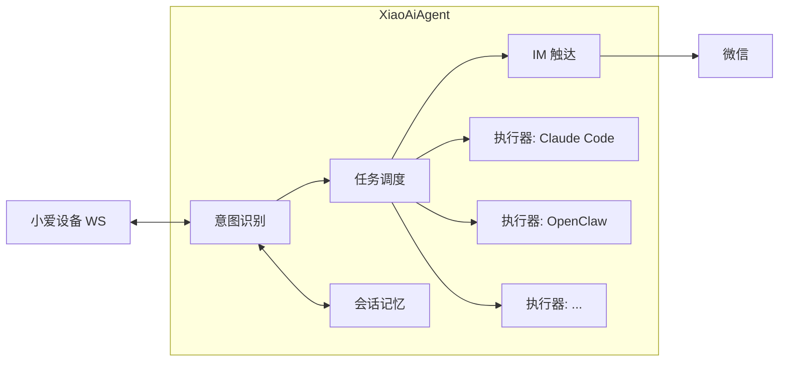

# XiaoAiAgent

[](https://github.com/luoliwoshang/open-xiaoai-agent/actions/workflows/ci.yml)
[](https://codecov.io/gh/luoliwoshang/open-xiaoai-agent)
[](https://goreportcard.com/report/github.com/luoliwoshang/open-xiaoai-agent)
[](https://golang.org/)
[](https://nodejs.org/)
[](LICENSE)

给「小爱同学」装上手和脚，让它从只会回答问题的语音助手，变成一个能干活、能主动找你的个人助理。

XiaoAiAgent 是 [`open-xiaoai`](https://github.com/idootop/open-xiaoai) 生态的服务端。唤醒小爱后你不只能聊天，还能直接派活 —— 做网页、写文档、整理数据、生成内容。多个任务同时跑，互不阻塞；任务完成后小爱会通过 IM 渠道主动通知你。

> [`open-xiaoai`](https://github.com/idootop/open-xiaoai) 负责设备桥接，`open-xiaoai-agent` 负责让小爱真正「动起来」。

## 它能做什么

```text
你：小爱同学，帮我做一个小白兔追击大灰狼的网页游戏。
小爱：收到，我先去处理。

你：再帮我写一个猎人打熊的故事，发给我。
小爱：好，一起安排。

你：今天适合出门吗？
小爱：适合，晴天 26 度。（对话不卡顿，后台任务继续跑）

    —— 几分钟后，微信收到消息 ——

小爱（微信）：你之前让我做的网页游戏完成了，去看看吧～
小爱（微信）：猎人的故事也写好了，发给你了～
```

## 特性

- **长出手脚** — 小爱不只是聊天窗口，它能真正执行任务、产出文件、操控电脑
- **主动触达** — 任务完成后通过 IM 渠道主动通知你（当前支持微信，更多渠道规划中）
- **多任务并发** — 同时派发多个任务，前台聊天不卡顿，后台并行处理
- **任务追更** — 随时追问进度、补充要求，系统记住是哪个任务在推进
- **会话记忆** — 每轮对话自动沉淀为长期记忆，下次唤醒时小爱记得之前聊过什么、做过什么
- **执行器可插拔** — 不绑定任何 agent 工具。Claude Code、Codex、OpenClaw 都只是执行者，随时可换

## 架构设计

XiaoAiAgent 的核心思路：**编排层和执行层分离**。



- **编排层**（本项目）：意图判断、任务生命周期管理、会话上下文、长期记忆、IM 网关
- **执行层**（可替换）：Claude Code CLI、Codex、OpenClaw 等 agent 工具，只负责「干活」

当前默认使用 Claude Code CLI 执行复杂任务，需要本机有 `claude` 命令。你可以替换成任何 agent 工具，编排层不变。

更多设计细节见 `docs` 目录。

## 快速开始

**1. 准备配置**

```sh
cp config.example.yaml config.yaml
```

按需修改 `config.yaml`：

```yaml
soul_path: ./SOUL.md

database:
  dsn: root:root@tcp(127.0.0.1:3306)/open_xiaoai_agent

openai:
  base_url: https://api.openai.com/v1

intent:
  model: qwen-turbo
  base_url: https://dashscope.aliyuncs.com/compatible-mode/v1
  api_key: sk-intent-placeholder

reply:
  model: qwen-turbo
  base_url: https://dashscope.aliyuncs.com/compatible-mode/v1
  api_key: sk-reply-placeholder

amap:
  api_key: ""

im:
  media_cache_dir: .cache/im-media
```

> `soul_path` 用来指定人设文件。它是必填项，支持相对路径和完整绝对路径；如果缺少或文件不存在，服务会在启动时直接报错退出。`config.yaml` 和你本地的 `SOUL.md` 都不应该提交到仓库。

**2. 启动 MySQL 并运行**

```sh
npm run db:up       # 启动 MySQL 容器
npm install
npm run dev         # 启动前后端
```

启动后自动建库建表，默认端口：

| 服务 | 地址 |
|------|------|
| WebSocket | `:4399` |
| Dashboard API | `:8090` |
| Debug Dashboard | `http://127.0.0.1:5173/#/` |

也可以只启动后端 `npm run dev:go` 或只启动前端 `npm run dev:fe`。

**3. 连接小爱设备**

```sh
echo 'ws://你的局域网IP:4399' > /data/open-xiaoai/server.txt
curl -sSfL https://gitee.com/idootop/artifacts/releases/download/open-xiaoai-client/init.sh | sh
```

> **注意**：当前版本暂不支持语音打断。小爱播报时不会响应新的唤醒词，请等小爱说完再下达新指令。

## 常用命令

```sh
npm run dev          # 启动前后端
npm run dev:go       # 只启动 Go
npm run dev:fe       # 只启动前端
npm run build:fe     # 构建前端
npm run db:ps        # 查看数据库状态
npm run db:logs      # 查看数据库日志
```

更多后端参数：`go run . -h`

## 验证

```sh
GOCACHE=$(pwd)/.gocache go test ./...
npm run build:web
```

## 依赖

- Go `1.24+`
- Node.js `20+`
- MySQL `8.x+`
- OpenAI 兼容接口（用于 intent / reply 模型）
- 高德天气 API Key（仅 `ask_weather` 需要）
- Claude Code CLI（仅异步任务需要，可替换为其他 agent）

## 当前限制

- IM Gateway 第一期只支持微信文本触达
- 还没有 IM 入站会话、群聊路由
- 还没有完善的人声打断检测
- 依赖外部 MySQL 服务

## License

[MIT](LICENSE)
