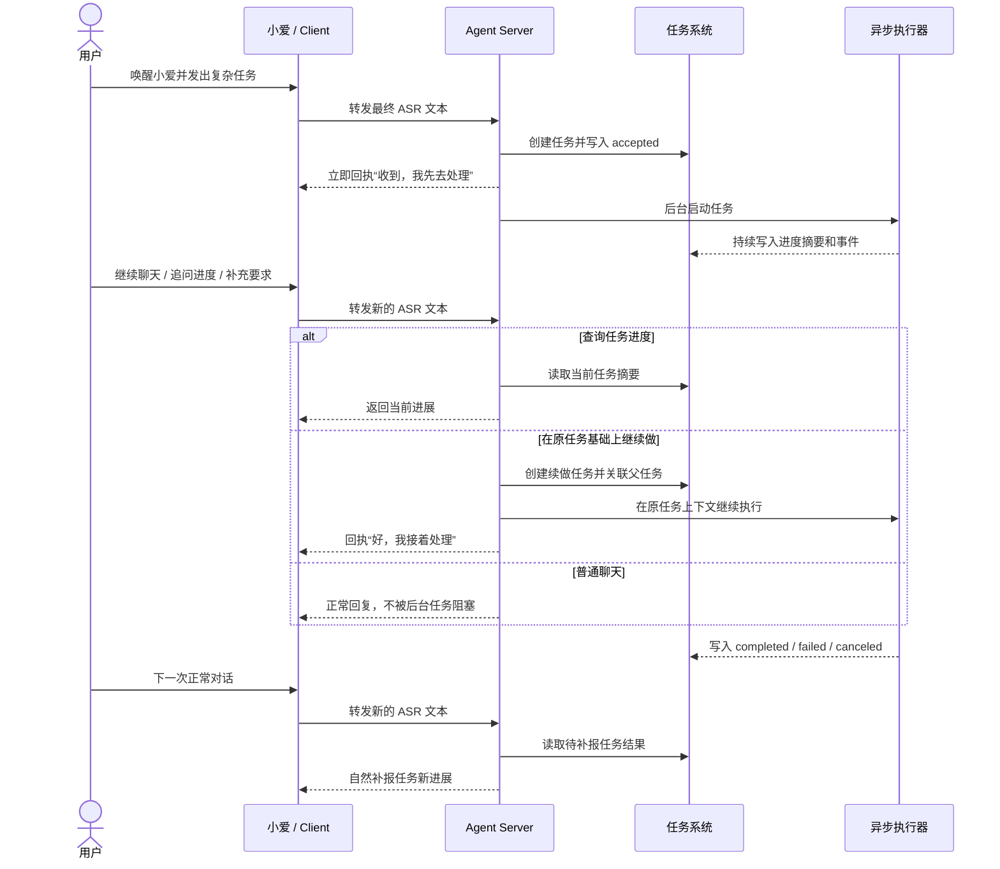

# 异步任务技术说明

这份文档只讲一件事：异步任务系统本身是怎么和主对话流程协作的。

它关注的是整体结构、状态流转、进度补报和任务续做这条主线，不展开具体执行器的接入细节。像 Claude Code 这种执行器的接入方式，会放在独立文档里说明。

## 设计目标

当前异步任务设计主要解决四件事：

1. 用户可以在正常对话里派发复杂任务，不阻塞当前对话。
2. 任务要有明确状态、进度和结果，而不是一句“我去做了”之后就丢失。
3. 任务执行器可以替换，任务总线本身不和某个具体 AI 工具强耦合。
4. 任务完成后，系统不是立即强行插话，而是在合适的后续对话时机补报结果。

## 1. 异步任务和主流程怎么协作

这个系统的关键点不是“后台能跑任务”，而是“后台任务不会打断主对话节奏，但又不会彻底脱离主对话”。

整体协作结构可以概括成五步：

1. 用户先像平常一样和小爱正常对话。
2. 当某句话被识别成复杂任务时，主流程先受理任务并立即回执。
3. 真正的任务执行转到后台继续进行，不阻塞当前这轮对话。
4. 用户可以继续聊天，也可以追问任务进度、补充要求或续做原任务。
5. 任务有结果后，不会立刻抢话，而是在后续合适的对话时机补报。

这个协作方式背后有两个产品取向：

- 前台要像助理，先接住用户，再安排事情。
- 后台要像执行层，持续干活，但不强行霸占用户当前注意力。

可以把这条协作链路理解成下面这张时序图：

## 2. 主流程里有哪几种关键动作

### 2.1 受理任务

在这个项目里，异步任务不是独立入口，而是工具系统的一种返回模式。

当某个工具返回：

- `async_accept`
- 并附带一份异步任务规格

主流程就不会把它当成普通同步工具，而是会：

1. 先向用户播报一句短回执。
2. 把任务登记到任务系统里。
3. 把真正执行动作交给后台。

这就是“不阻塞当前对话”的核心：  
前台先完成受理和回执，后台再继续慢慢干活。

### 2.2 后台执行

后台开始执行后，主流程本身并不会被锁住。

这意味着：

- 用户可以继续问天气、闲聊或发起别的请求。
- 系统可以同时维护“当前这轮对话”和“后台正在跑的任务”。
- 对用户来说，复杂任务不再等同于一次长时间卡住的会话。

### 2.3 进度上报

后台执行期间，执行器可以不断汇报阶段性进度。

当前进度上报分成两层：

- 面向用户理解的阶段摘要
- 面向系统追踪的事件流

这样设计的目的，是把“用户现在最关心的进度一句话”单独抽出来，而不是让前端或语音层自己从一堆细碎日志里猜。

### 2.4 结果补报

任务完成、失败或取消后，系统不会立即强行开启一轮新对话去打断用户。

当前策略是：

1. 先把任务结果落到状态系统里。
2. 标记这条结果“还没有向用户补报”。
3. 等用户下一次正常进入对话流程时，再顺带自然地说出来。

这个选择很重要，因为它把“后台任务完成”从系统事件，转换成了“对用户体验友好的后续通知”。

### 2.5 查询、取消和续做

异步任务不是“说完就丢”的一次性动作，主流程里还支持三类继续协作：

- 查询进度：用户可以追问刚刚那个任务做到哪了。
- 取消任务：用户可以把最近一个还在跑的任务停掉。
- 续做任务：用户可以在原任务基础上继续补充要求，而不是从头重新派一个完全割裂的新任务。

这三类能力，才让异步任务真正有“助理感”，而不是只有一个后台队列。

## 3. 为什么要延迟补报，而不是立刻打断

这是当前设计里很重要的产品选择。

如果任务一完成就立刻插话，理论上更“实时”，但实际上会带来几个问题：

- 打断用户当前正在进行的会话
- 让多任务并行时的语音体验变乱
- 让系统频繁抢占当前播放链路

所以当前做法不是“任务一结束就播”，而是“任务一结束先记下来，等下一轮正常对话时自然补报”。

这个机制带来的好处是：

- 用户不会被后台任务完成事件硬打断
- 补报仍然能进入会话上下文
- 任务状态和是否已通知用户是两回事，可以分开管理

## 4. 数据模型

讲完协作结构，再看数据模型会更容易理解。

当前通用任务记录至少包含这些信息：

- `id`
- `plugin`
- `kind`
- `title`
- `input`
- `parent_task_id`
- `state`
- `summary`
- `result`
- `report_pending`
- `created_at`
- `updated_at`

这些字段各自解决的问题是：

- `id`：唯一标识一条任务
- `plugin` / `kind`：知道这条任务最初由谁受理、属于哪类执行
- `title` / `input`：保留用户任务的可读标题和原始输入
- `parent_task_id`：把“这次是续做之前那个任务”表达出来
- `state`：表示当前所处阶段
- `summary`：给用户和前端看的当前阶段摘要
- `result`：保存最终结果文本
- `report_pending`：表示结果是否还没向用户补报
- `created_at` / `updated_at`：用于排序和追踪时序

## 5. 任务产物

任务除了有状态和结果，也可以有文件型产物。

当前这期实现先只做一个最小边界：

- 产物只挂在当前 `task_id` 上
- 暂时不做父任务聚合视图
- 任务一旦进入 `completed`，就不再允许新增产物
- Dashboard 可以直接查看并下载该任务的产物

这里最关键的设计点，不是“把文件存下来”，而是“插件和任务系统之间不要直接传本地路径”。

### 5.1 插件怎么汇报产物

插件现在通过任务汇报接口直接提交：

- 产物名称
- 产物类型
- MIME 类型
- 内容流
- 文件大小

也就是说，插件可以在自己内部用临时文件、内存字节或工具输出组织内容，但真正跨过主流程边界时，传递的是“流 + 元数据”，不是 `/tmp/xxx` 这种执行器私有路径。

这样做的原因很直接：

- 主流程不需要知道执行器的本地文件结构
- 后续切换别的执行器时，不会把路径协议耦合进任务总线
- 产物最终存到哪里，由任务系统自己决定

### 5.2 产物存到哪里

当前任务产物会落到本地缓存目录，由配置项统一指定：

- `task.artifact_cache_dir`

默认值是：

- `.cache/task-artifacts`

任务系统会在这个目录里按任务归档文件，数据库只保存元数据和内部存储路径映射。

这意味着：

- 插件不用关心最终存储布局
- Dashboard 下载时也不需要反推执行器工作目录
- 后续如果要把本地缓存切到别的存储后端，边界仍然是稳定的

### 5.3 哪些产物算“要交付”

除了上传产物本身，插件还可以声明当前任务里哪些产物要被标记为“交付产物”。

这一步当前只做任务内标记，不做真正的渠道投递状态。

这样先把模型立住：

- 一个任务可以有多个产物
- 其中一部分可以被标记为后续对外交付的候选
- 当前阶段先在 Dashboard 中可见、可下载

### 5.4 Dashboard 怎么拿到产物

当前 Dashboard 有两条读取路径：

- `/api/state`
  返回任务列表、事件流以及产物元数据
- `/api/tasks/{task_id}/artifacts/{artifact_id}/download`
  直接下载某个任务下的具体产物

这个设计的目的，是把“任务概览”和“文件下载”分开：

- 看板刷新时只拿轻量元数据
- 真正点下载时才去读本地缓存文件

## 6. 任务状态

当前状态只有五种：

- `accepted`
- `running`
- `completed`
- `failed`
- `canceled`

这些状态的语义是：

- `accepted`：系统已经受理，但后台执行还没真正开始
- `running`：后台正在执行
- `completed`：任务已经完成，并且有最终结果
- `failed`：任务执行失败
- `canceled`：任务被取消

这里有个实践上很重要的点：

- `summary` 看起来像完成，不代表状态一定已经完成

所以查询进度时，不能只看一句摘要，还要同时看真实状态。

## 7. 事件流和摘要为什么要同时存在

当前任务系统里，除了任务主记录，还有一条事件流。

两者分工不同：

- 任务主记录：保存当前快照，适合快速展示和查询
- 事件流：保存过程变化，适合还原执行过程

常见事件包括：

- 受理
- 开始执行
- 进度更新
- 完成
- 失败
- 取消
- 执行器自定义事件

而 `summary` 之所以单独放在任务主记录里，是因为：

- 用户追问进度时，最需要的是一句当前结论
- 语音补报时，也更适合读一段已经整理好的摘要
- 前端看板做概览时，不应该每次都重新扫描整条事件流

## 8. 为什么需要 `parent_task_id`

异步任务如果只有独立任务 ID，而没有父子关系，很容易变成“一次次重开新任务”，上下文链路会断掉。

`parent_task_id` 的作用，就是把这些情况串起来：

- 刚刚那个网页再改一下
- 在上一个故事基础上继续写
- 不是重做，而是在之前产出上追加要求

当前策略不是覆盖旧任务，而是创建一条新任务，并把它挂回原任务下面。

这样做的好处是：

- 原任务记录不会丢
- 续做链路清楚
- 后续可以继续做更完整的任务树视图

## 9. 为什么要把通用任务层和执行器私有层分开

当前设计故意把任务系统拆成两层：

### 9.1 通用任务层

这里保存所有执行器都需要的共性信息：

- 任务状态
- 任务摘要
- 任务结果
- 事件流
- 是否待补报
- 父子任务关系

### 9.2 执行器私有层

这里保存某个具体执行器恢复上下文所需的私有信息。

这样拆的原因很直接：

- 主任务层要保持通用
- 不同执行器恢复上下文的方式不一样
- 将来接入更多执行器时，不需要污染主任务模型

## 10. 当前主流程已经支持哪些协作能力

从用户视角看，当前异步任务系统已经支持：

- 发起复杂任务
- 后台执行
- 持续追踪进度
- 查询当前进展
- 取消最近活跃任务
- 在已完成任务基础上继续做
- 在后续对话里自然补报任务结果

## 11. 当前边界

当前系统仍有几个明确边界：

- 任务补报不是主动抢占式插话，而是挂到后续对话时机里再说
- 取消任务当前是“取消最近一个活跃任务”，不是任意精确选择
- 续做能力当前主要面向“已完成任务继续补充”，不是任意运行中任务热接管
- 执行器虽然可插拔，但不同执行器的恢复能力仍然要各自实现

## 12. 后续扩展时应继续保持的边界

如果后面继续接入 Codex、OpenClaw、OpenCode 等执行器，建议继续遵守这些原则：

1. 主任务层只保存通用任务信息，不保存执行器私有恢复状态。
2. 执行器私有状态独立管理，不回灌污染主任务模型。
3. 所有执行器都统一接到同一套异步任务总线上。
4. 任务续做仍然由原执行器负责恢复，而不是放到全局层硬编码处理。

这样扩展时，新增的只是“一个新的执行器实现”，而不是推翻整个异步任务结构。
