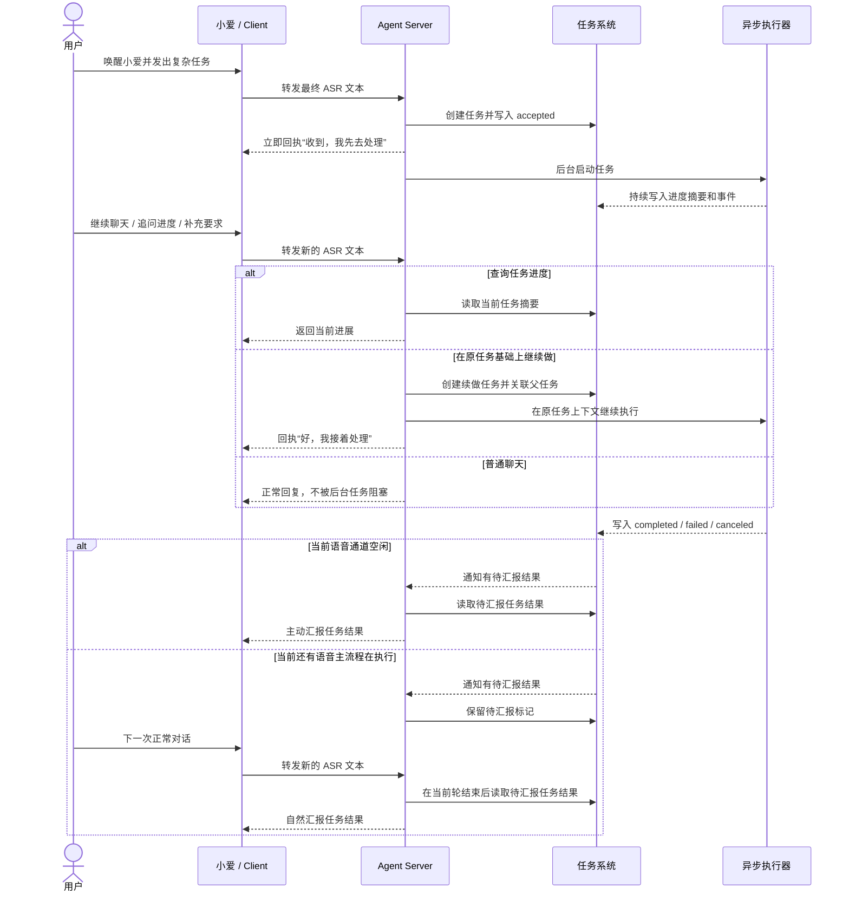
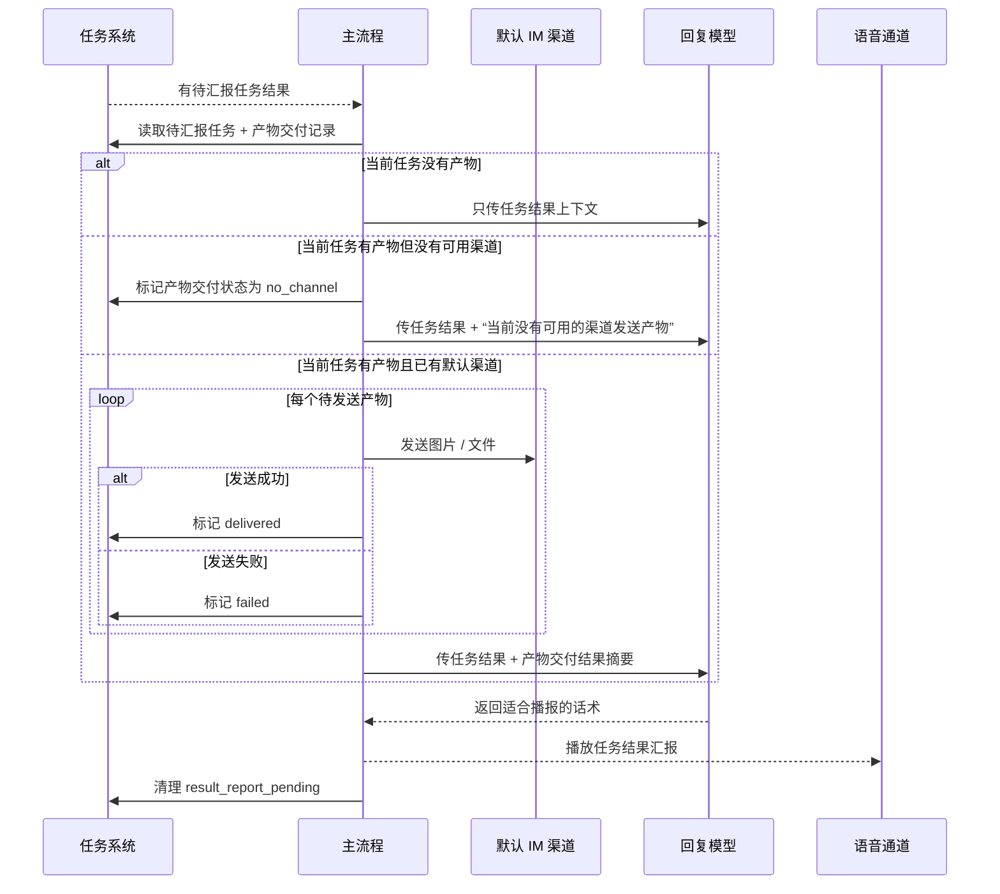

# 异步任务技术说明

这份文档只讲一件事：异步任务系统本身怎么和主对话流程协作。

它关注的是：

- 主流程怎么受理复杂任务
- 后台任务怎么更新进度
- 任务结果什么时候汇报
- 任务产物什么时候尝试发到默认 IM 渠道
- 当前通用任务层实际用了哪些数据表

像 Claude Code 这种具体执行器怎么接入，会放在独立文档里说明。

## 设计目标

当前异步任务设计主要解决五件事：

1. 用户可以在正常对话里派发复杂任务，不阻塞当前对话。
2. 任务要有明确状态、阶段摘要和结果，而不是一句“我去做了”之后就丢失。
3. 主流程只负责受理、编排和汇报，不和某个具体执行器强耦合。
4. 任务完成后，系统会在合适时机主动做任务结果汇报，而不是粗暴抢话。
5. 如果任务产出了图片、文件等产物，主流程会在结果汇报前先看默认 IM 渠道能不能发，再把交付情况自然带进汇报内容。

## 1. 异步任务和主流程怎么协作

这个系统的关键点不是“后台能跑任务”，而是“后台任务不会打断主对话节奏，但又不会彻底脱离主对话”。

整体协作结构可以概括成五步：

1. 用户先像平常一样和小爱正常对话。
2. 当某句话被识别成复杂任务时，主流程先受理任务并立即回执。
3. 真正的任务执行转到后台继续进行，不阻塞当前这轮对话。
4. 用户可以继续聊天，也可以追问任务进度、补充要求或续做原任务。
5. 任务进入最终态后，系统会在语音通道空闲时主动做任务结果汇报；如果当前忙，就延后到安全时机。

这个协作方式背后有两个产品取向：

- 前台像助理，先接住用户，再安排事情。
- 后台像执行层，持续干活，但不强行霸占用户当前注意力。

## 2. 主流程里的关键动作

### 2.1 受理任务

在这个项目里，异步任务不是独立入口，而是工具系统的一种返回模式。

当某个工具返回：

- `async_accept`
- 并附带一份异步任务规格

主流程就不会把它当成普通同步工具，而是会：

1. 先向用户播报一句短回执。
2. 把任务登记到任务系统里。
3. 把真正执行动作交给后台。

这就是“不阻塞当前对话”的核心：前台先完成受理和回执，后台再继续慢慢干活。

### 2.2 后台执行

后台开始执行后，主流程本身并不会被锁住。

这意味着：

- 用户可以继续问天气、闲聊或发起别的请求。
- 系统可以同时维护“当前这轮对话”和“后台正在跑的任务”。
- 对用户来说，复杂任务不再等同于一次长时间卡住的会话。

### 2.3 进度上报

后台执行期间，执行器可以不断汇报阶段性进度。

当前进度上报分成两层：

- 面向用户理解的阶段摘要
- 面向系统追踪的事件流

这样设计的目的，是把“用户现在最关心的进度一句话”单独抽出来，而不是让前端或语音层自己从一堆细碎日志里猜。

### 2.4 任务结果汇报

任务完成、失败或取消后，系统不会立即强行开启一轮新对话去打断用户。

当前策略是：

1. 先把任务结果落到状态系统里。
2. 标记这条结果“还没有向用户做任务结果汇报”。
3. 如果当前语音通道空闲，就主动做任务结果汇报。
4. 如果当前还有主流程正在播报或处理，就先保留待汇报标记，等当前轮结束后再汇报。

这个选择很重要，因为它把“后台任务完成”从系统事件，转换成了“对用户体验友好的后续通知”。

Dashboard 当前也会暴露主语音通道的运行时状态，至少包含：

- 当前是否正在处理一轮会发声的主流程
- 当前是否已有待汇报结果 ready，但因为语音通道忙而暂未播报
- 当前是否已经保留了一个可用于主动播报的最近语音通道

#### 2.4.1 结果汇报的触发链路

任务结果真正“向用户说出来”的过程，当前可以理解成下面这条链路：

1. 后台任务进入最终态。
   当前会触发汇报的最终态包括：
   - `completed`
   - `failed`
   - `canceled`

2. 任务系统把结果写回任务记录。
   这一步会更新：
   - `state`
   - `summary`
   - `result`
   - `result_report_pending = true`

3. 任务系统主动通知主流程：现在有一条结果可以尝试做任务结果汇报了。
   这里不是靠定时轮询数据库，而是任务状态刚变化时触发一次事件通知。

4. 主流程判断当前语音通道是否空闲。
   - 如果当前没有别的会发声流程在运行，就立即开始汇报。
   - 如果当前还在处理别的对话或播报，就先保留 `result_report_pending`，等当前轮结束后再尝试。

5. 真正汇报时，不会机械地念任务标题，而是把待汇报任务整理成一段结构化上下文，再交给回复模型生成适合 TTS 的话术。

6. 只有这段汇报真正播放成功后，系统才会把对应任务标记为“已汇报”，也就是清掉 `result_report_pending`。

这个时序有两个实际效果：

- 如果任务刚完成且当前设备空闲，用户会听到一条主动汇报。
- 如果任务完成时用户还在进行别的对话，这条结果不会丢，而是延后到安全时机再播。

还有一个很重要的边界：

- 当前主动汇报的是“任务最终结果”，不是每一条运行中进度都自动播报。
- 如果结果汇报生成失败、播放失败，`result_report_pending` 不会被清掉，后续仍然有机会再次汇报。

#### 2.4.2 结果汇报前先尝试发送产物

当前实现里，任务结果汇报不是只“念一段总结”。

如果这些待汇报任务下面挂了产物，主流程会先检查默认 IM 渠道能不能发送这些产物，再把交付结果带进后面的结果汇报上下文。

当前规则非常收敛：

1. 没有产物：
   不拼任何“产物交付”说明。
2. 有产物，但当前没有可用默认 IM 渠道：
   把这些产物交付记录记成 `no_channel`，并在结果汇报上下文里补一句“当前没有可用的渠道发送产物”。
3. 有产物，也有可用默认 IM 渠道：
   逐个尝试发送产物。
4. 某个产物发送成功：
   把该产物交付记录记成 `delivered`，并在结果汇报上下文里自然带出“已发送到微信”之类的信息。
5. 某个产物发送失败：
   把该产物交付记录记成 `failed`，并把失败事实带进结果汇报上下文。

当前这期只处理“任务产物”的发送，不处理“任务最终文本结果也同步发到 IM”。

当前这期也暂时不处理：

- 用户后续重新绑定通知渠道后，对旧产物自动补发
- 一份产物发给多个目标
- 任务完成后继续追加新产物

从产品语义上看，这里仍然要把“任务完成”和“结果交付”拆开理解：

- 任务完成：表示执行器已经把这次事情做完了，结果、摘要和产物都已经稳定落下来了。
- 结果交付：表示这些产物有没有真正通过某个通知渠道送到用户手里。

当前系统已经把这两件事拆开建模了，但本期只实现：

- 任务结果汇报前，按当前默认 IM 渠道即时尝试一次产物发送
- 没有可用渠道时，明确告诉用户当前发不出去

还没有实现：

- 用户后续重新绑定渠道后的自动补发
- “任务最终文本结果也走 IM” 这条链路

#### 2.4.3 当前实现层链路

这个链路的产品意义是：

- 如果任务产物已经发到了微信，用户听到结果汇报时就知道可以直接去看。
- 如果任务确实产出了文件，但当前还没有通知渠道，系统也会明确说出来，而不是让用户以为文件已经发走了。
- 如果本次任务根本没有产物，就不会平白多一段无关说明。

### 2.5 查询、取消和续做

异步任务不是“说完就丢”的一次性动作，主流程里还支持三类继续协作：

- 查询进度：用户可以追问刚刚那个任务做到哪了。
- 取消任务：用户可以把最近一个还在跑的任务停掉。
- 续做任务：用户可以在原任务基础上继续补充要求，而不是从头重新派一个完全割裂的新任务。

这三类能力，才让异步任务真正有“助理感”，而不是只有一个后台队列。

## 3. 为什么要延迟做任务结果汇报，而不是立刻打断

这是当前设计里很重要的产品选择。

如果任务一完成就立刻插话，理论上更“实时”，但实际上会带来几个问题：

- 打断用户当前正在进行的会话
- 让多任务并行时的语音体验变乱
- 让系统频繁抢占当前播放链路

所以当前做法不是“任务一结束就强行插话”，而是“任务一结束先记下来；如果当前空闲就主动做任务结果汇报，如果当前忙就等安全时机再汇报”。

这个机制带来的好处是：

- 用户不会被后台任务完成事件硬打断
- 系统空闲时又不需要死等到下一次对话才能告诉用户结果
- 结果汇报仍然能进入会话上下文
- 任务状态和是否已通知用户是两回事，可以分开管理

## 4. 通用任务数据模型

讲完协作结构，再看数据模型会更容易理解。

当前通用任务记录至少包含这些信息：

- `id`
- `plugin`
- `kind`
- `title`
- `input`
- `parent_task_id`
- `state`
- `summary`
- `result`
- `result_report_pending`
- `created_at`
- `updated_at`

这些字段各自解决的问题是：

- `id`：唯一标识一条任务
- `plugin` / `kind`：知道这条任务最初由谁受理、属于哪类执行
- `title` / `input`：保留用户任务的可读标题和原始输入
- `parent_task_id`：把“这次是续做之前那个任务”表达出来
- `state`：表示当前所处阶段
- `summary`：给用户和前端看的当前阶段摘要
- `result`：保存最终结果文本
- `result_report_pending`：表示任务结果是否还没向用户汇报
- `created_at` / `updated_at`：用于排序和追踪时序

## 5. 任务产物

任务除了有状态和结果，也可以有文件型产物。

当前这期实现先只做一个最小边界：

- 产物只挂在当前 `task_id` 上
- 暂时不做父任务聚合视图
- 任务一旦进入 `completed`，就不再允许新增产物
- Dashboard 可以直接查看并下载该任务的产物

这里最关键的设计点，不是“把文件存下来”，而是“插件和任务系统之间不要直接传本地路径”。

### 5.1 插件怎么登记产物

插件当前通过任务汇报接口直接提交：

- 产物名称
- 产物类型
- MIME 类型
- 内容流
- 文件大小

也就是说，插件可以在自己内部用临时文件、内存字节或工具输出组织内容，但真正跨过主流程边界时，传递的是“流 + 元数据”，不是 `/tmp/xxx` 这种执行器私有路径。

这样做的原因很直接：

- 主流程不需要知道执行器的本地文件结构
- 后续切换别的执行器时，不会把路径协议耦合进任务总线
- 产物最终存到哪里，由任务系统自己决定

### 5.2 产物存到哪里

当前任务产物会落到本地缓存目录，由配置项统一指定：

- `task.artifact_cache_dir`

默认值是：

- `.cache/task-artifacts`

任务系统会在这个目录里按任务归档文件，数据库只保存元数据和内部存储路径映射。

这意味着：

- 插件不用关心最终存储布局
- Dashboard 下载时也不需要反推执行器工作目录
- 后续如果要把本地缓存切到别的存储后端，边界仍然是稳定的

### 5.3 交付记录怎么建

当前语义已经收敛为：

- 只要某个产物被登记进任务系统，就默认会创建一条对应的交付记录
- 不再额外要求插件手动声明“哪些产物要交付”

也就是说，旧的“产物上单独带一个 `deliver` 标记”的方向已经去掉了。

当前交付记录只表达一件事：

- 这份产物后续有没有尝试过发给默认 IM 渠道，以及结果如何

这里再强调一个产品语义：

- “任务已经完成”是任务级状态
- “结果有没有真正送到用户”不能只用一个任务级布尔值表达

原因很直接：

- 一个任务可能同时有多个产物
- 图片可能已经送达，但另一个文件还在等待渠道或等待重试

所以交付状态当前放在 artifact 级别维护，而不是塞回任务主表。

### 5.4 Dashboard 怎么拿到产物

当前 Dashboard 有两条读取路径：

- `/api/state`
  返回任务列表、事件流以及产物元数据
- `/api/tasks/{task_id}/artifacts/{artifact_id}/download`
  直接下载某个任务下的具体产物

这个设计的目的，是把“任务概览”和“文件下载”分开：

- 看板刷新时只拿轻量元数据
- 真正点下载时才去读本地缓存文件

## 6. 任务状态

当前状态有六种：

- `accepted`
- `running`
- `completed`
- `failed`
- `canceled`
- `superseded`

这些状态的语义是：

- `accepted`：系统已经受理，但后台执行还没真正开始
- `running`：后台正在执行
- `completed`：任务已经完成，并且有最终结果
- `failed`：任务执行失败
- `canceled`：任务被取消
- `superseded`：旧任务已经被新的补充要求接管，不再继续推进

这里有个实践上很重要的点：

- `summary` 看起来像完成，不代表状态一定已经完成

所以查询进度时，不能只看一句摘要，还要同时看真实状态。

### 6.1 执行中补充要求，为什么不是原地修改旧任务

当前 `continue_task` 已经扩大成统一的“继续这条任务链”语义：

- 如果 source task 已完成，就基于它创建新的 child task
- 如果 source task 仍在 `accepted / running`，就先中断旧执行，再把旧 task 标成 `superseded`，然后创建新的 child task 接管这条链

这里故意不做“原地把同一个 task 改参数继续跑”，原因是：

- 每次用户补充输入都应该留下单独的 task 记录
- `parent_task_id` 可以把整条任务链串起来
- Claude 这类执行器可以继续复用原来的 session，但任务系统里的审计链路不会丢

这也意味着：

- `superseded` 不是失败
- `superseded` 也不是取消
- 它表示“旧执行被新的续做任务正式接管”

对当前 Claude 执行器来说，接管动作具体就是：

- 先停掉旧 task 对应的 Claude CLI 进程
- 保留它已经建立的 `session_id`
- 再在新的 child task 上用 `claude --resume <session_id>` 继续补充要求

## 7. 事件流和摘要为什么要同时存在

当前任务系统里，除了任务主记录，还有一条事件流。

两者分工不同：

- 任务主记录：保存当前快照，适合快速展示和查询
- 事件流：保存过程变化，适合还原执行过程

常见事件包括：

- 受理
- 开始执行
- 进度更新
- 完成
- 失败
- 取消
- 执行器自定义事件
- 产物已发送
- 产物发送失败
- 当前没有可用渠道发送产物

而 `summary` 之所以单独放在任务主记录里，是因为：

- 用户追问进度时，最需要的是一句当前结论
- 语音结果汇报时，也更适合读一段已经整理好的摘要
- 前端看板做概览时，不应该每次都重新扫描整条事件流

## 8. 为什么需要 `parent_task_id`

异步任务如果只有独立任务 ID，而没有父子关系，很容易变成“一次次重开新任务”，上下文链路会断掉。

`parent_task_id` 的作用，就是把这些情况串起来：

- 刚刚那个网页再改一下
- 在上一个故事基础上继续写
- 不是重做，而是在之前产出上追加要求

当前策略不是覆盖旧任务，而是创建一条新任务，并把它挂回原任务下面。

这样做的好处是：

- 原任务记录不会丢
- 续做链路清楚
- 后续可以继续做更完整的任务树视图

## 9. 为什么要把通用任务层和执行器私有层分开

当前设计故意把任务系统拆成两层。

### 9.1 通用任务层

这里保存所有执行器都需要的共性信息：

- 任务状态
- 任务摘要
- 任务结果
- 事件流
- 是否待汇报
- 父子任务关系
- 产物元数据
- 产物交付状态

### 9.2 执行器私有层

这里保存某个具体执行器恢复上下文所需的私有信息。

这样拆的原因很直接：

- 主任务层要保持通用
- 不同执行器恢复上下文的方式不一样
- 将来接入更多执行器时，不需要污染主任务模型

## 10. 当前主流程已经支持哪些协作能力

从用户视角看，当前异步任务系统已经支持：

- 发起复杂任务
- 后台执行
- 持续追踪进度
- 查询当前进展
- 取消最近活跃任务
- 在已完成任务基础上继续做
- 在语音通道空闲时主动做任务结果汇报
- 在系统忙时延后到安全时机再汇报
- 在有默认 IM 渠道时，先尝试发送任务产物再做结果汇报

## 11. 当前实际数据表

这一节只列当前异步任务主线已经实际落地的通用表，不展开 IM、日志、会话等其他子系统。

### 11.1 `tasks`

任务主表，保存当前快照。

核心字段：

- `id`
- `plugin`
- `kind`
- `title`
- `input`
- `parent_task_id`
- `state`
- `summary`
- `result`
- `result_report_pending`
- `created_at`
- `updated_at`

### 11.2 `task_events`

任务事件流，保存过程变化。

核心字段：

- `id`
- `task_id`
- `type`
- `message`
- `created_at`

### 11.3 `task_artifacts`

任务产物元数据表，保存某个任务下有哪些产物，以及这些产物在本地缓存里的内部存储位置。

核心字段：

- `id`
- `task_id`
- `kind`
- `file_name`
- `mime_type`
- `storage_path`
- `size_bytes`
- `created_at`

### 11.4 `task_artifact_deliveries`

任务产物交付表，保存某个产物是否已经尝试发到默认 IM 渠道，以及结果如何。

当前一份产物只对应一条交付记录。

核心字段：

- `id`
- `task_id`
- `artifact_id`
- `account_id`
- `target_id`
- `channel_label`
- `status`
- `provider_message_id`
- `last_error`
- `created_at`
- `updated_at`
- `delivered_at`

当前 `status` 取值包括：

- `pending`
- `no_channel`
- `delivered`
- `failed`

## 12. 当前边界

当前系统仍有几个明确边界：

- 任务结果汇报不会主动抢占当前语音通道；如果系统正在处理别的语音主流程，就会延后汇报
- 当前只在结果汇报前处理任务产物交付，不处理任务最终文本结果的 IM 发送
- 当前没有默认 IM 渠道时，只会明确告知“当前没有可用的渠道发送产物”，不会做后续自动补发
- 一份产物当前只对应一条交付记录，不做多目标群发
- 续做能力当前主要面向“已完成任务继续补充”，不是任意运行中任务热接管
- 执行器虽然可插拔，但不同执行器的恢复能力仍然要各自实现

## 13. 后续扩展时应继续保持的边界

如果后面继续接入 Codex、OpenClaw、OpenCode 等执行器，建议继续遵守这些原则：

1. 主任务层只保存通用任务信息，不保存执行器私有恢复状态。
2. 执行器私有状态独立管理，不回灌污染主任务模型。
3. 所有执行器都统一接到同一套异步任务总线上。
4. 产物交付结果和任务主结果分开建模，不把渠道细节塞回任务主表。
5. 任务续做仍然由原执行器负责恢复，而不是放到全局层硬编码处理。

这样扩展时，新增的只是“一个新的执行器实现”，而不是推翻整个异步任务结构。

## 13. 当前相关表

这一节只列当前已经存在、并且和异步任务直接相关的 MySQL 表。

这样后面如果要继续讨论“结果交付”“交付项”“补发”“重试”等设计，就可以直接在这份基线上讨论增改，而不是重新猜当前库里到底有什么。

当前直接相关的表主要有四张：

- `tasks`
- `task_events`
- `task_artifacts`
- `claude_records`

另外还有一张会被异步任务间接依赖的配置表：

- `settings`

### 13.1 `tasks`

这是异步任务主表，保存任务当前快照。

当前字段：

- `id`
- `plugin`
- `kind`
- `title`
- `input`
- `parent_task_id`
- `state`
- `summary`
- `result`
- `result_report_pending`
- `created_at`
- `updated_at`

当前语义：

- `input` 保存这次任务的原始用户请求
- `summary` 保存当前阶段摘要
- `result` 保存最终结果文本
- `result_report_pending` 只表达“任务结果是否还没做语音结果汇报”

这里要特别注意：

- `tasks` 里目前还没有“是否已经通过 IM 交付给用户”的字段
- 也没有“每个交付项是否送达”的结构

### 13.2 `task_events`

这是任务事件流表，保存过程型变化。

当前字段：

- `id`
- `task_id`
- `type`
- `message`
- `created_at`

当前用途：

- 记录任务受理
- 记录任务开始执行
- 记录进度更新
- 记录完成 / 失败 / 取消
- 记录产物登记等过程事件

它解决的是“过程可追踪”，不是“当前快照展示”。

### 13.3 `task_artifacts`

这是任务产物表，保存某个任务产出的文件型结果。

当前字段：

- `id`
- `task_id`
- `kind`
- `file_name`
- `mime_type`
- `storage_path`
- `size_bytes`
- `deliver`
- `created_at`

当前语义：

- `storage_path` 是任务系统内部缓存路径，不对外暴露为执行器边界协议

这里也要特别注意：

- 当前实现里仍然保留着 `deliver` 字段
- 但按当前产品方向，这个字段应该被移除
- 原因是当前讨论已经收敛为：只要 artifact 存在，就默认进入后续交付范围，不再需要单独用一个布尔值挑“哪些 artifact 要交付”

也就是说，`task_artifacts` 当前能表达的是：

- 这个任务产出了哪些文件

但它还不能表达：

- 这个文件是否已经送达用户
- 失败了几次
- 发到了哪个 IM 账号 / target

### 13.4 `claude_records`

这是当前 Claude Code 执行器的私有状态表，不属于通用任务模型，但和异步任务续做强相关。

当前字段：

- `task_id`
- `session_id`
- `prompt`
- `working_directory`
- `status`
- `last_summary`
- `last_assistant_text`
- `result`
- `error`
- `created_at`
- `updated_at`

当前作用：

- 保存 Claude 自己的恢复上下文
- 让 `continue_task` 能继续接回 Claude 会话

这里故意和 `tasks` 分离，避免把执行器私有状态污染到通用任务主表。

### 13.5 `settings`

这张表不是任务表，但会影响结果交付层的行为。

当前和这个话题直接相关的 key 有：

- `session.window_seconds`
- `im.delivery.enabled`
- `im.delivery.selected_account_id`
- `im.delivery.selected_target_id`

当前语义：

- 它只保存“系统当前默认怎么交付”
- 它不保存“某个具体任务、某个具体产物是否已经送达”

### 13.6 当前还没有的表

这部分也很关键，因为后面讨论设计时，不能把“想要的模型”误认为“现在已经有了”。

当前还没有专门用于表达下面这些语义的表：

- 某个 artifact 的送达状态表
- 某个 artifact 的失败 / 重试记录表

也就是说，当前数据库里已经能稳定表达的是：

- 任务本身
- 任务过程事件
- 任务产物
- 执行器私有恢复状态

但还不能完整表达的是：

- 一个 artifact 有没有真正送达用户
- 这个 artifact 是通过哪个 IM 账号、发给哪个 target 的
- 没有 IM 时哪些 artifact 在等待渠道
- 后续补发时具体补发了哪些 artifact

### 13.7 当前讨论中的目标表

按当前这轮产品讨论，第一期可以先不做通用“交付项”模型，也先不处理任务最终文本结果的 IM 发送，而是先只落一张 artifact 交付表。

建议目标表：

- `task_artifact_deliveries`

建议字段：

- `id`
- `task_id`
- `artifact_id`
- `account_id`
- `target_id`
- `status`
- `provider_message_id`
- `last_error`
- `created_at`
- `updated_at`
- `delivered_at`

当前先约定的语义边界：

- 一个 artifact 只会发送一次
- 一条 artifact 交付记录只会绑定一个 target
- 当前不考虑一份 artifact 多次发送给不同用户
- 当前不考虑任务最终文本结果的 IM 交付

这样这一期先解决的就是最核心的问题：

- artifact 已经产出了没有
- artifact 有没有等到可用渠道
- artifact 最终发给了哪个账号 / target
- artifact 发送成功还是失败
